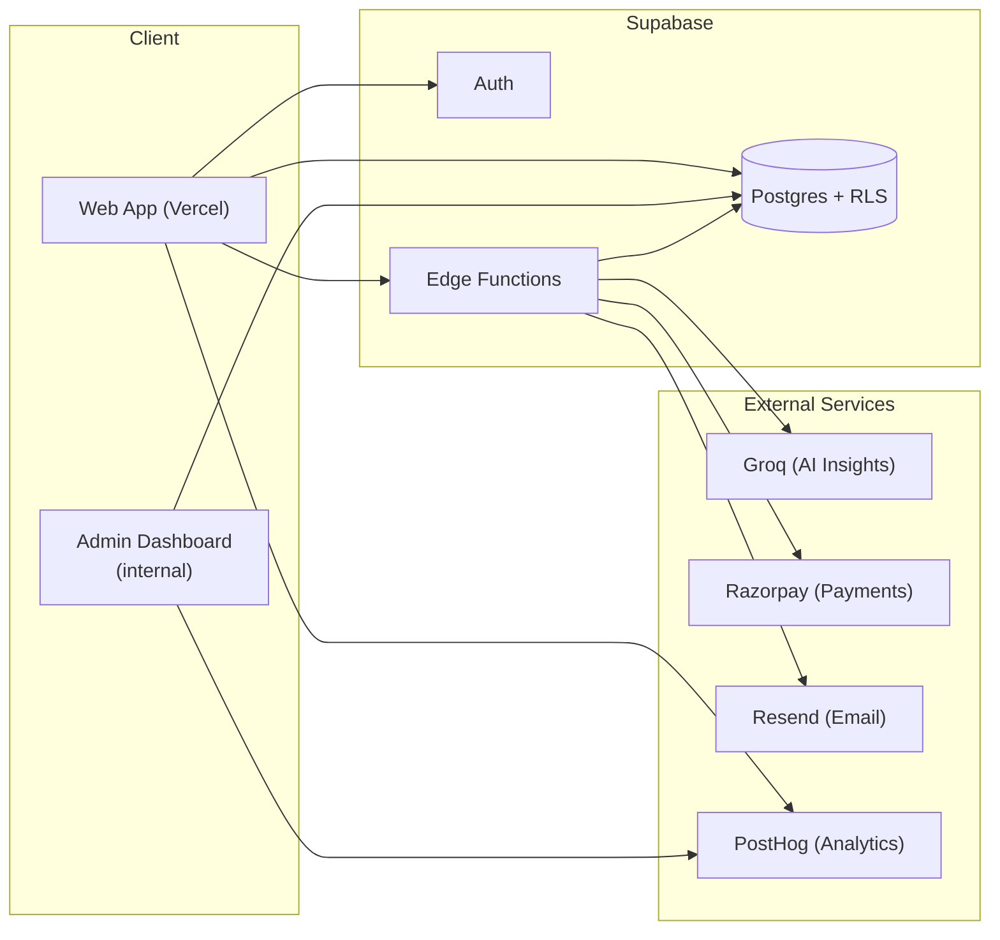

 

# JEETrack

### An all-in-one preparation tracker for JEE aspirants

**[jeetrack.in →](https://www.jeetrack.in)**

 

## What it is

JEETrack is a mock-test, syllabus-progress, and AI-insights web app for
students preparing for India's JEE engineering entrance exam. Built and
maintained solo — frontend, backend, payments, and an internal admin
dashboard for running it.

> This is a **showcase repo** — architecture, engineering write-ups, and a
> couple of generalized code patterns from the project. The full production
> source (frontend + database + edge functions) is kept in a private
> repository, since JEETrack is a live product handling real user data and
> payments.

 

## Tech stack

| Layer | Stack |
|---|---|
| Frontend | Vanilla HTML / CSS / JS, deployed on Vercel |
| Backend | Supabase — Postgres, Auth, Row-Level Security, Edge Functions (Deno) |
| Payments | Razorpay — server-verified orders, webhook-backed confirmation |
| AI Insights | Groq (LLM inference) |
| Transactional email | Resend |
| Product analytics | PostHog — funnels, retention, session insights |

 

## Architecture

 

## What's in it

- **Mock test tracking** — scores, subject-wise breakdowns, trend over time
- **Syllabus progress tracker** — chapter-level completion across subjects
- **AI-generated insights** — pattern detection on a student's own prep data
- **Streaks & consistency tracking**
- **Support/donation flow** — Razorpay-backed, fully server-verified (see
  engineering notes below)
- **Internal admin dashboard** — feature-usage analytics, activation
  funnels, DAU/WAU/MAU, user demographics, and operational tooling —
  powered by PostHog instead of ad-hoc database queries, so it doesn't add
  load to the production database just to check a number

 

## Engineering notes

A few problems worth writing up — the kind that show up once real usage
starts, not while building the first version.

### 1. Debounced, diff-only sync

Every checkbox tick, timer log, and streak update used to fire its own write.
At scale that's a lot of redundant round-trips for data that mostly hasn't
changed. The sync layer now:

- Batches rapid edits behind a short debounce window
- Diffs the in-memory state against the last-synced snapshot and only
  upserts rows that actually changed
- Flushes immediately on tab-hide / unload so nothing is lost on close

See [`snippets/debounced-diff-sync.js`](snippets/debounced-diff-sync.js) for
a generalized version of the pattern.

### 2. RLS performance

Row-Level Security policies that call `auth.uid()` directly get
re-evaluated **per row** on every query. Rewriting those calls as
`(select auth.uid())` lets Postgres treat it as a stable sub-select instead —
same security guarantee, meaningfully less query time on larger tables.

Also worth watching: a `SECURITY DEFINER` view that bypassed RLS entirely to
serve a public-facing read. Fixed by adding an explicit RLS policy with the
same filter and switching the view to `SECURITY INVOKER`, so access is
actually gated by the row-level policy rather than the view owner's
permissions.

### 3. Payment integrity

Donations/support payments go through Razorpay with three layers, none of
which trust the client:

- **Order amount is set server-side** (an Edge Function creates the Razorpay
  order) — the client can never influence what gets charged
- **Payment signature is verified server-side** via HMAC-SHA256 before
  anything is marked "paid"
- **A webhook is the source of truth**, not the browser callback — if a
  user's tab closes right after paying, the payment is still recorded
  because Razorpay's server calls the webhook directly
- Both the callback and the webhook write to the same table via an **upsert
  keyed on the payment ID**, so a retried or duplicated call never creates a
  second row

See [`snippets/verified-payment-webhook.ts`](snippets/verified-payment-webhook.ts)
for a generalized version of the verification pattern.

### 4. Analytics without hammering the database

Feature usage, activation funnels, and DAU/WAU/MAU used to be derived from
raw Supabase row-counts on demand — every time someone wanted a number, it
meant a live query over production data. That's now tracked as proper
events in PostHog instead, so checking usage stats costs nothing on the
database side.

 

## Screenshots

<!-- Add screenshots/GIFs here — dashboard, admin panel, etc. -->

 

## About

Built solo by [Aman Mishra](https://www.jeetrack.in/about). Free to use,
always — this repo exists to talk about how it's built, not to sell it.
