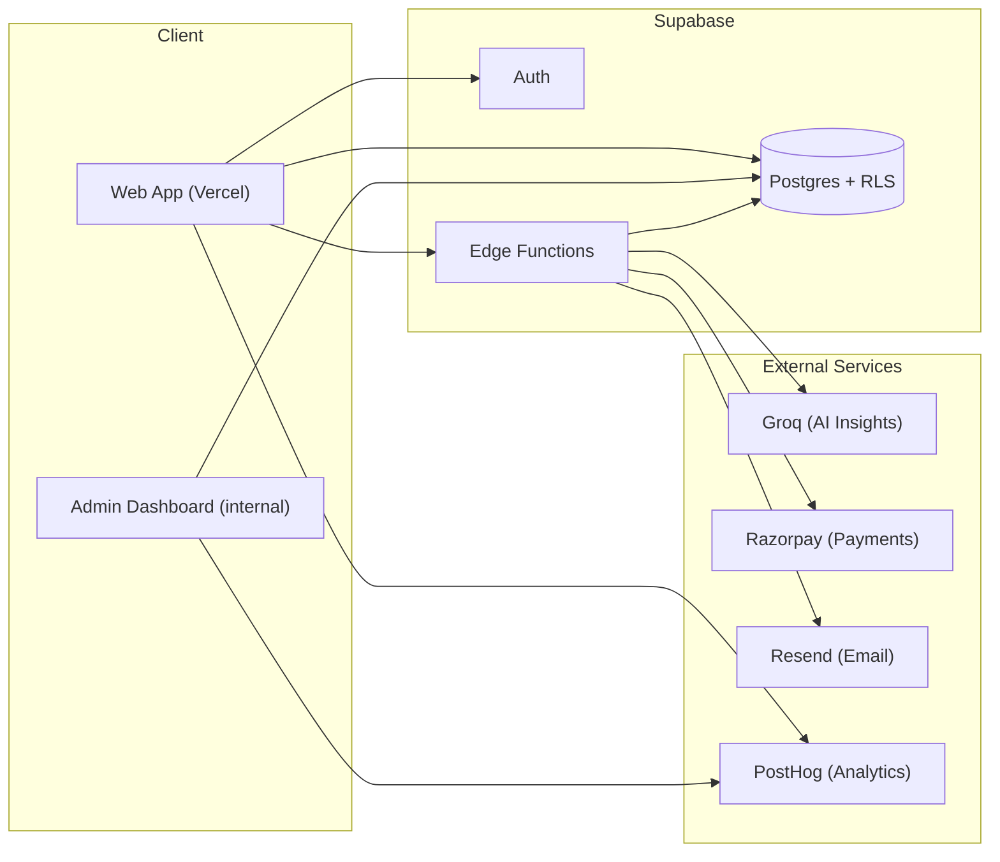

# Architecture

A high-level overview of how JEETrack is built. For engineering
deep-dives and generalized code patterns, see
[`jeetrack-showcase`](https://github.com/AmanxMishraDev/jeetrack-showcase) —
this page just gives the map.

## Stack

| Layer | Stack |
|---|---|
| Frontend | Vanilla HTML / CSS / JS, deployed on Vercel |
| Backend | Supabase — Postgres, Auth, Row-Level Security, Edge Functions (Deno) |
| Payments | Razorpay — server-verified orders, webhook-backed confirmation |
| AI Insights | Groq (LLM inference, LLaMA 3.3 70B) |
| Transactional email | Resend |
| Product analytics | PostHog — funnels, retention, session insights |

## Diagram

## Why this shape

- **Edge Functions as the trust boundary** — anything that touches a
  secret (Groq API key, Razorpay key secret, Resend key) runs server-side
  in a Supabase Edge Function. The client never holds a credential more
  sensitive than a public API key.
- **RLS instead of app-level access checks** — access control is enforced
  in the database itself, not just in application code, so a bug in the
  frontend can't accidentally expose another user's data.
- **PostHog instead of live database queries for analytics** — usage
  metrics are tracked as events, not derived from ad-hoc queries against
  production tables, so checking a number doesn't add load to the app
  itself.
- **Webhooks as source of truth for payments** — the browser's payment
  callback is treated as a hint, not a fact. Razorpay's server-to-server
  webhook is what actually confirms a payment, so a closed tab or flaky
  connection can't cause a paid support contribution to go unrecorded.

## Where the code lives

- **Production source** (frontend, schema, Edge Functions) — private repo,
  since it's a live product handling payments and user data
- **Engineering write-ups + generalized snippets** —
  [`jeetrack-showcase`](https://github.com/AmanxMishraDev/jeetrack-showcase)
- **This repo** — docs, FAQ, roadmap, and the place to file issues
